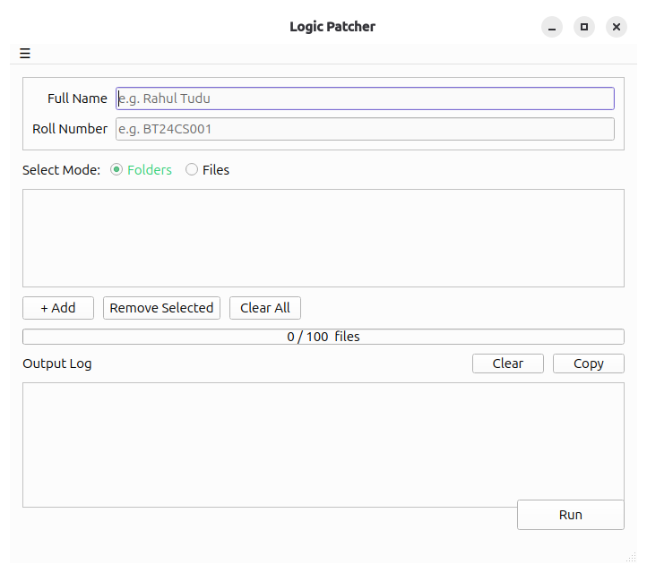
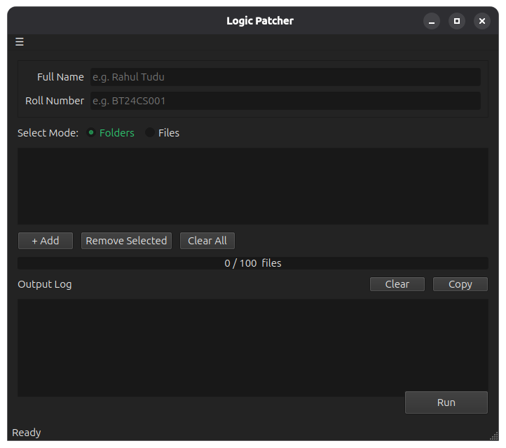

# Logic Patcher

A fast, cross-platform utility that patches `.logic` binary files by finding and replacing the encoded student name and roll number stored inside. Ships with a polished GUI and a scriptable CLI.

> [!WARNING]
> **USE AT YOUR OWN RISK**
>
> This tool modifies academic `.logic` files. By using it, you accept **full and sole responsibility** for any consequences, including:
>
> - **File corruption or data loss** — patches may not work correctly on all file versions
> - **Academic misconduct** — if your teacher, professor, or institution catches you, I am **not responsible and cannot be blamed** in any way
> - **Disciplinary action** — use of this tool may violate your institution's academic integrity policy, potentially resulting in serious penalties
> - **Educational conflicts** — any dispute with your institution resulting from use of this tool is entirely your own problem
>
> The author bears **zero liability**. You have been warned.

<table>
  <tr>
    <td></td>
    <td></td>
  </tr>
  <tr>
    <td align="center">Light mode</td>
    <td align="center">Dark mode</td>
  </tr>
</table>

## Features

- Recursively scans folders for `.logic` files and replaces the encoded name and roll number in one click
- Accepts individual files or entire folder trees — drag-and-drop supported
- Parallel processing via `ThreadPoolExecutor` for fast batch patching
- Live log output with colour-coded results and a real-time progress bar
- Download and install updates directly from within the app (Linux)
- Automatic light / dark theme that follows the system colour scheme
- Output written to a `replaced_output/` subfolder — originals are never touched
- Zero runtime dependencies beyond the standard library (GUI requires PySide6)

## Installation

### Download a pre-built binary (recommended)

Head to [Releases](https://github.com/jack-thesparrow/logic-patcher/releases/latest) and grab the file for your platform:

| Platform | File |
|---|---|
| Linux (amd64) | `logic-patcher_*_amd64.deb` |
| Linux (arm64) | `logic-patcher_*_arm64.deb` |
| Windows | `logic-patcher-gui.exe` |

**Linux — install the deb:**

```bash
sudo dpkg -i logic-patcher_*_amd64.deb
logic-patcher-gui          # launch the GUI
logic-patcher --help       # use the CLI
```

**Windows** — double-click `logic-patcher-gui.exe`. No installation required.

### Run from source

**Prerequisites**

| Platform | Command |
|---|---|
| Ubuntu / Debian | `sudo apt install python3 python3-venv` |
| Fedora / RHEL | `sudo dnf install python3 python3-virtualenv` |
| Arch | `sudo pacman -S python` |
| Windows / macOS | Install Python 3.8+ from [python.org](https://python.org) |

**Quick setup**

```bash
# Linux / macOS
bash bootstrap.sh

# Windows (PowerShell)
.\bootstrap.ps1
```

The bootstrap script creates a virtualenv, installs all dependencies, runs the test suite, and registers the app icon in your desktop environment.

**Manual setup**

```bash
python3 -m venv .venv
source .venv/bin/activate        # Windows: .\.venv\Scripts\activate
pip install -e ".[gui]"
```

## Usage

### GUI

Launch the app:

```bash
logic-patcher-gui
```

1. Enter the **Full Name** and **Roll Number** to write into the files
2. Choose **Folders** or **Files** mode using the toggle
3. Add paths by clicking **+ Add** or dragging and dropping into the list
4. Click **Run** — patched files appear in `replaced_output/` next to the source

The app follows your system theme automatically and supports in-app updates (Linux).

### CLI

```bash
logic-patcher "Full Name" "ROLLNUMBER" /path/to/folder
```

**Example:**

```bash
logic-patcher "Jane Doe" "BT21CS001" ~/Downloads/exam-files
```

**Output:**

```
[OK] session1.logic
   replaced: 'Old Name BT21CS001'
[--] notes.logic (anchor not found)

===== SUMMARY =====
Files changed : 1 / 2
Output folder : ~/Downloads/exam-files/replaced_output
```

Log prefixes:

| Prefix | Meaning |
|---|---|
| `[OK]` | File patched successfully |
| `[--]` | File had no recognisable name field — copied unchanged |
| `[!!]` | Patch skipped due to internal mismatch |

## How it works

`.logic` files are Java-serialised binary objects. The student name and roll number are stored as a Java `TC_STRING` immediately following a fixed 20-byte anchor sequence. Logic Patcher locates the anchor, reads the length-prefixed UTF-8 string, overwrites it with the new value, and updates the 2-byte big-endian length field — leaving every other byte in the file untouched.

## Development

### Run tests

```bash
python -m unittest tests.test_core -v
```

### Project structure

```
logic-patcher/
├── logic_patcher/
│   ├── core.py       # binary parsing, patching, parallel processing
│   ├── cli.py        # CLI entry point
│   ├── gui.py        # PySide6 GUI entry point
│   └── utils.py      # shared file I/O and logging helpers
├── tests/
│   └── test_core.py
├── scripts/
│   ├── build_deb.sh  # PyInstaller → Debian package
│   └── build_exe.sh  # PyInstaller → Windows executables
├── assets/
│   ├── icon.svg
│   ├── light.png     # GUI screenshot — light mode
│   └── dark.png      # GUI screenshot — dark mode
├── bootstrap.sh      # Linux / macOS dev environment setup
├── bootstrap.ps1     # Windows dev environment setup
└── pyproject.toml
```

### Build packages locally

```bash
# Debian package (Linux)
bash scripts/build_deb.sh
# → build/deb/logic-patcher_*_amd64.deb

# Windows executables (run on Windows or a CI Windows runner)
bash scripts/build_exe.sh
# → dist/logic-patcher-gui.exe
# → dist/logic-patcher.exe
```

## CI / CD

| Workflow | Trigger | What it does |
|---|---|---|
| `ci.yml` | Push / PR to `main` | Runs the test suite on Python 3.8, 3.10, 3.12 |
| `release.yml` | Push a `v*` tag | Builds `.exe` + `.deb`, publishes to PyPI, creates GitHub Release |

### Publishing a release

```bash
git tag v1.x.x
git push origin v1.x.x
```

The release workflow attaches the built binaries to the GitHub Release automatically.

## License

MIT — see [LICENSE](LICENSE).
